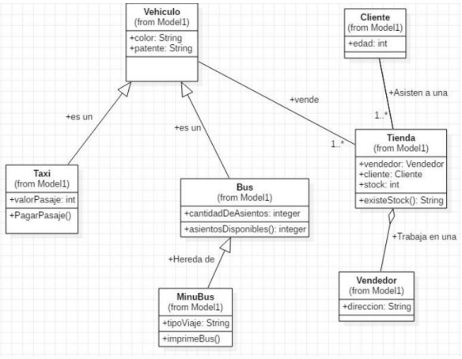

Desafío - Automotora
--

Descripción
--
El IDE para el desarrollo de la solución será Eclipse. Para este desafío utilizaremos el
diagrama del desafío “ Automotora II”.

Requerimientos
1. Crear la clase vehículo que contiene los atributos descritos más abajo, generar los
   “getters and setters” para cada campo y su respectivo Constructor.
   (1 Punto)

       color, patente
2. Crear la clase Taxi que contiene un atributo llamado valorPasaje, generamos su
   “getter and setter” para el campo y un Constructor.
   (1 Punto)
3. Crear la clase Bus que se extiende de vehículo, la cual contiene el atributo
   cantidadDeAsientos, luego generamos su “getter and setter” para el campo y un
   Constructor.
   (1 Punto)
4. Crear la clase Minibus que extiende de Bus que contiene un atributo llamado
   tipoViaje, generamos su “getter and setter” correspondiente y su Constructor.
   (1 Punto)
5. Crear la clase Persona que contiene los atributos descritos más abajo, generamos los
   “getters and setters” para cada campo y un Constructor.
   (1 Punto)

       rut, nombre, edad
6. Crear la clase Cliente que extiende de Persona, la cual contiene un atributo llamado
   edad, generamos su “getter and setter” para el campo y un Constructor.
   (1 Punto)
7. Crear la clase Vendedor que extiende de Persona, la cual contiene un atributo llamado
   dirección, generamos el “getter and setter” para el campo y un Constructor.
   (2 Puntos)
8. Crear la clase Tienda que contiene los atributos descritos más abajo, generamos su
   “getters and setters” para cada campo y un Constructor. Además, incorporar el
   método existeStock() para que nos retorne el stock.
   (2 Puntos)

       Vendedor vendedor, Vehiculo vehiculo, stock

- Consideraciones para cada clase:

-Taxi
    Método pagarPasaje:
        -Ingresar el monto por parámetro, antes de pagar el pasaje se debe validar
        que este monto sea mayor al valor del pasaje inicial.
        - Si se cumple, devolver el vuelto.
        - Si no se cumple, devolver el pasaje original.

-Bus
    Método asientos disponibles:
        -Retornar la cantidad de asientos disponibles.

-MiniBus 
    Método imprime Bus:
        -Imprimir todos los atributos de las clases.

-Tienda
    Método existe Stock:
        -Retornar el stock con el mensaje “cantidad de stock es...” más valor. 
        Por ejemplo: “Cantidad de stock es 44”.
